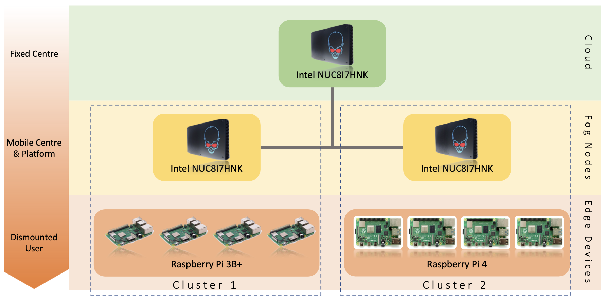
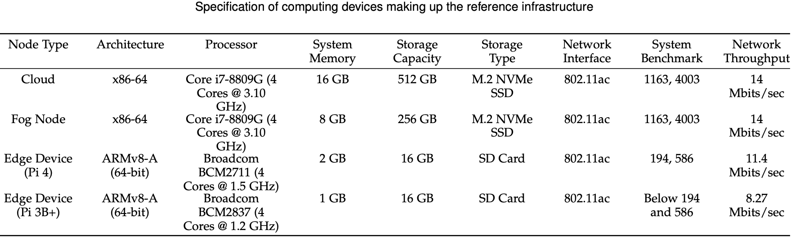
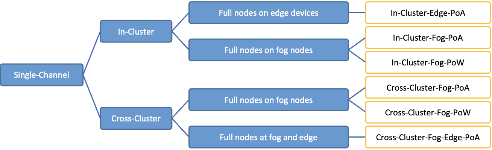

# Context

The Adelaide IoT testbed is an extensible collection of adaptable and configurable test kits, comprising fog and edge computing devices. These test kits resemble ad-hoc computing infrastructures that are rapidly assembled in the field for purposes such as emergency response after disasters that might have rendered the existing infrastructure inoperable. Such ad-hoc infrastructures can be used to operate and provide computing services to IoT sensors and autonomous systems. 

Leveraging blockchain within and across such ad-hoc infrastructures is an emerging trend for securing the related IoT data and services. However, it is unknown the extent to which ad-hoc IoT-centric infrastructures can support a blockchain network. 

This project aims to empirically evaluate the performance and resource consumption of operating a blockchain upon an ad-hoc infrastructure. We focus on single-channel blockchains, meaning all participants jointly maintain a single set of records. We benchmarked multiple topology, deployment structure, and protocol configurations. 

# Experiment Design

## Hardware Configuration

The experimental hardware infrastructure are made up of two IoT test kits, acting as two clusters. In a real-world scenario, these clusters might cover different areas within a disaster struck region and operated by different entities. 

## Experiment Blockchain Configurations

We conducted experiments using the Ethereum blockchain platform. Two blockchain protocols were utilised, including Proof-of-Work (PoW) and the Proof-of-Authority (PoA), which is a resource-saving variation. 

## Instrumentation

- [Hyperledger Caliper](https://hyperledger.github.io/caliper/) benchmark suite was used to produce workload and measure the performance of the deployed blockchain
- [Prometheus](https://prometheus.io) infrastructure monitoring tool was deployed to monitor the deployed clusters and retrieve resource consumption metrics.

## Variables

Independent variables: 6 blockchain configurations + baseline (no blockchain)

Dependent variables
- blockchain transaction latency
- blockchain transaction throughput
- total cpu time
- total disk read (bytes)
- total disk write (bytes)
- filesystem sizes (bytes)
- available system memory (bytes)
- total network receive (bytes)
- total network transmit (bytes)
- battery level of Raspberry Pi (percentage)

# Resources

- [Datasets](https://github.com/CREST-Adelaide/LIEF-LIT-SingleBC-Dataset)